# How it works

[← back to the README](../README.md)

```mermaid
flowchart LR
    A[intake] --> B[reconcile<br/>AIS · TIS · 26AS]
    B --> P[parse<br/>broker statements]
    P --> C[form select<br/>ITR-1/2/3/4]
    C --> D[schedule select]
    D --> E[compute<br/>deterministic]
    E --> F[fill the portal<br/>field by field]
    F --> G[pre-flight]
    G --> H[file + e-verify]
    H --> I[post-filing<br/>rectify · revise]

    style P fill:#0b5fff,color:#fff
    style E fill:#0b5fff,color:#fff
    style B fill:#0b5fff,color:#fff
```



`SKILL.md` is a router, under the 500-line spec budget, loaded when the skill
triggers. The ten files under `references/` load only when a phase needs them,
so a question about Schedule CG never pays for the post-filing corpus.

Two disciplines run through all of it.

**Verify your own numbers.** Every rate, limit and deadline is shape, not truth.
The skill records what it checked, against which source, on what date, and treats
a rule used but not recorded as a defect.

**Tag your evidence.** Claims carry `[observed]` for something seen on a live
screen or read out of a filed JSON, `[documented]` for a notified form or
validation-rules PDF, `[inferred]`, or `[UNVERIFIED]`. Two confidently-stated
claims in this skill were demoted after re-examination. Where a published source
and a live screen disagree, the screen wins and the conflict gets recorded.

## Tests

```bash
python3 .github/scripts/validate_skills.py                      # spec conformance
python3 .github/scripts/test_parsers.py                         # parsers vs fixtures
python3 .github/scripts/scan_pii.py                             # no real tax data
python3 .github/scripts/check_stated_counts.py                  # docs match the tree
python3 skills/itr-filing-copilot/scripts/pdf_crypt.py           # cipher known answers
python3 skills/itr-filing-copilot/scripts/compute_tax.py --self-test
python3 skills/itr-filing-copilot/scripts/compute_tax.py \
    --golden skills/itr-filing-copilot/evals/golden/cases.json
```

All of it runs in CI on every push, with no dependencies beyond PyYAML for the
issue-template check. CI additionally asserts that nothing under `scripts/`
imports a third-party package, which is the only way that promise stays true.

`check_stated_counts.py` exists because prose rots. It derives the number of
scripts, reference files and CI checks from the tree and fails the build when a
sentence disagrees — this page said "eight files under `references/`" when there
were nine, and `docs/scripts.md` had never documented `parse_bank_statement.py`
at all.

`evals/` has three tiers: golden cases that assert exact figures and required
refusals with no model involved, output-quality evals, and trigger queries that
test whether the description fires on real asks and stays quiet on near misses.
Adding a golden case is a JSON edit.


